# Drakengard 3 (NPUB31251) Türkçe Yama
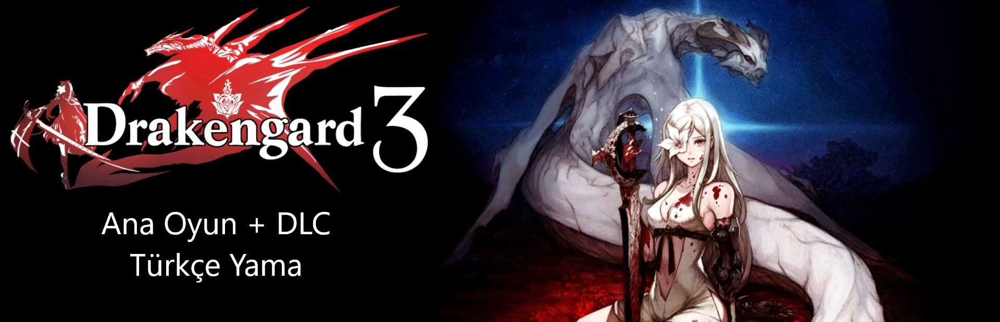

NieR serisinin *köklerinin köklerini* anlatan Drakengard 3 (Japon adıyla Drag-On Dragoon 3) oyunu için tamamladığım Türkçe yamayı burada paylaşıyorum.

Amacım benim gibi NieR evrenini sevmiş, benimsemiş, tutkusu haline getirmiş Türk hayranlarının bu oyunu dil engeli olmadan tadını çıkarabilmelerini sağlamaktır.
## Oyun Hakkında
- NieR oyunlarından farklı evrende geçse bile ilk Drakengard oyununun sonlarından biriyle evrenler birbirine bağlanmaktadır. Drakengard 3 ise ondan da öncesini konu almaktadır, hem NieR hem de Drakengard serisi ele alındığında kronolojik olarak ilk sıradaki oyundur.
- Tıpki NieR gibi sırayla A, B, C, D sonları olarak bitiriliyor ama her bir sona bağlanan olaylar oldukça farklılaşmaktadır ve birbirinden bağımsız farklı sonuçlara sebep olmaktadır. Replicant gibi *"aynı şeyleri 3-4 kere daha yap ama yeni bağlamlar öğren"* durumu yok. Ayrıca hikayede bu çoklu branşların/sonların olayı da açıklanıyor.
- NieR gibi açık dünya değil, her biri farklı ortamlarda geçen bölümlerle ilerleniyor. Çoğu bölüm A noktasından B noktasına giderek tamamlanıyor bazıları da "autoscroller" tarzı gerekli şartları sağlayarak kendi kendine ilerleniyor, bazıları da direkt Boss Fight.
- Bölüm aralarında silahlar, ekipmanlar, müttefikler ayarlanıp sonraki bölüme devam ediliyor.
- Dövüş sistemi iki NieR oyununun karışımı gibi. Automata gibi her silahın boyutuna göre farklı komboları var. Replicant gibi savunma/savuşturma (parry/counter-attack) mekaniği var. Soulslike manyağıysan doğru zamanlamayla oyundaki hemen hemen her şey savuşturulabiliyor :)

### Hikaye Konusu
Ters çevrilmiş Avrupa kıtasına benzeyen Midgard denen bir diyarda bitmeyen savaş ve kaos hakimdi. Günün birinde mistik şarkılarla kontrol ettikleri tanrısal güçlere sahip sonrasında *Intoner* adı verilmiş kız kardeşler ortaya çıkmış. Intonerlar, tüm zalim hükümdarları alt ederek bütün Midgard'ın mutlak egemenliğini ele alarak dünyada barış ve huzuru sağlamışlar. Ama Intonerların hükümdarlığı altındaki "Lale Devri", ana karakterimiz -Intonerların yaşça en büyüğü- Zero'nun ortaya çıkmasıyla fazla sürmemiş. Intoner kardeşlerini öldürmeye yemin etmiş olan Zero, yanında sadık ejderhası ve dostu Michael ile kanlı seferine başlar.
> [!WARNING]
> **Oyunun diyalogları ağır kara mizah, bel altı muhabbetleri ve benzeri rahatsız edici, tetikleyici olabilecek üsluplar içermektedir.**

## Yama Özellikleri
- NPUB31251 (US) v.1.01 sürümünü desteklemektedir.
- Oyunun orijinal dili Japonca, tabii Japonca bilmediğim için çeviriyi dublajlı ve hafif sansürlenmiş İngilizce metinler üzerinden gerçekleştirdim.
- Tüm ana oyun ve 6 hikaye DLC diyalogları, arayüz metinleri ve alt metinler çevrildi.
- **Çevirdiğim DLC'ler: Five's Chapter, Four's Chapter, Three's Chapter, Two's Chapter, One's Chapter ve Zero's Chapter.**
- Oyunda desteklenmeyen (boşluk veya kare olarak görünen) Türkçe harfler (Ğ/ğ, Ş/ş, İ/ı) yazı tipine entegre edildi.
- Metin içeren texture'lar çevrilmiş alternetifleriyle değiştirildi.
- Çevirilerin çoğunluğu kendi el çevirimdir. Sadece içinden çıkamadğım aşırı belirsiz metinlerde yeterince arkaplan bağlamı sağladığım yapay zekadan yardım aldım.
> [!NOTE]
> ***Çeviri yeteneğimi kesinlikle mükemmel bulmuyorum, hatalar, mantıksızlıklar falan olabilir. Elimden geldiğince düz çevirmekten kaçınmaya, cümleleri aynı mesajı verecek şekilde değiştirmeye ve daha renkli üsluplar kullanmaya çalıştım, ama tabii ki gelecek iyileştirmelere açıktır.***

## Ekran Görüntüleri
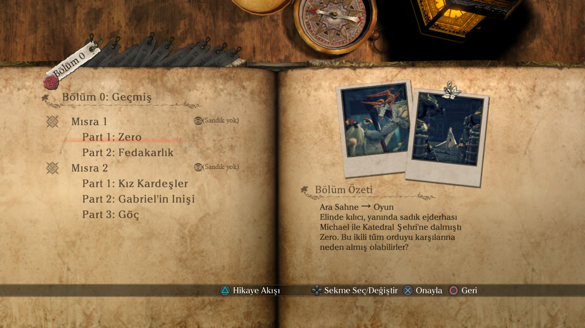 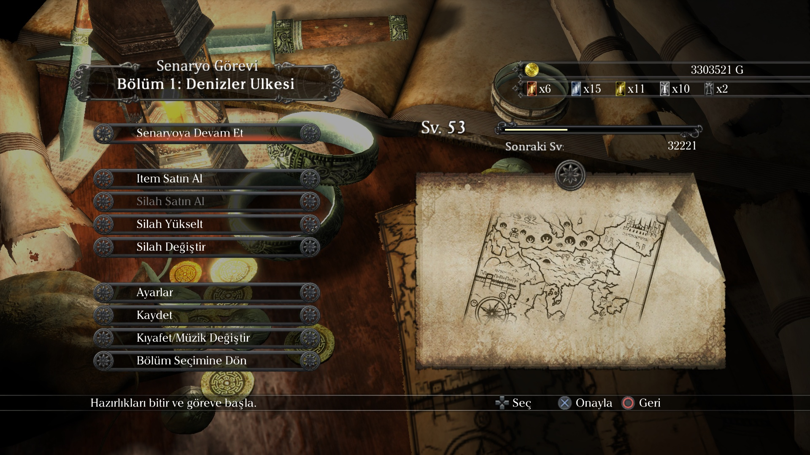
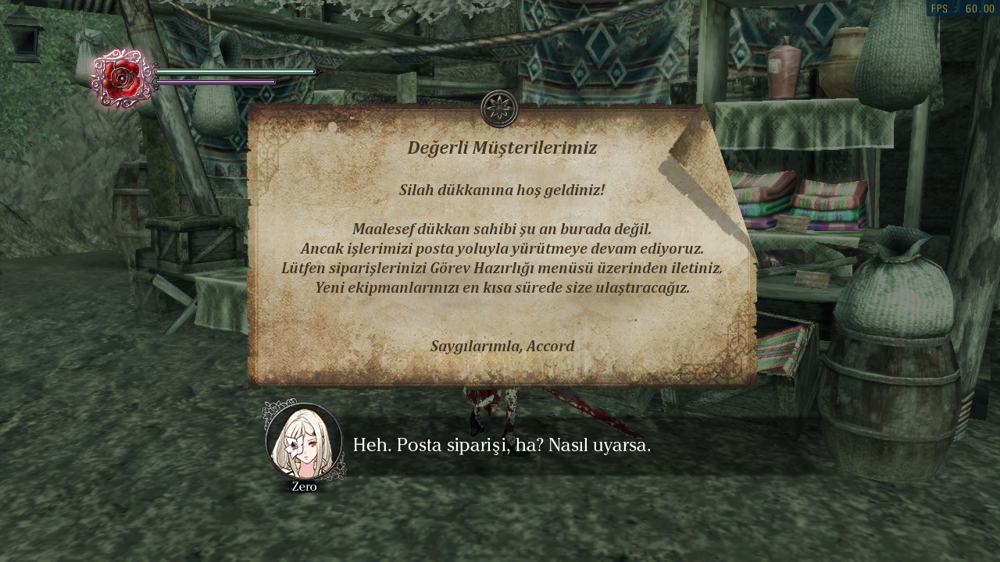 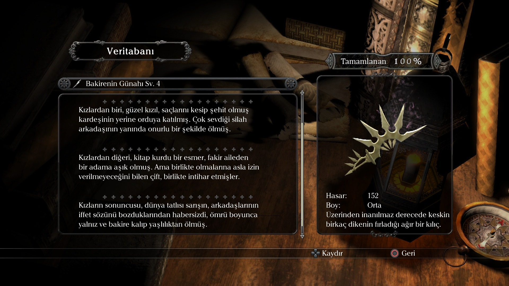
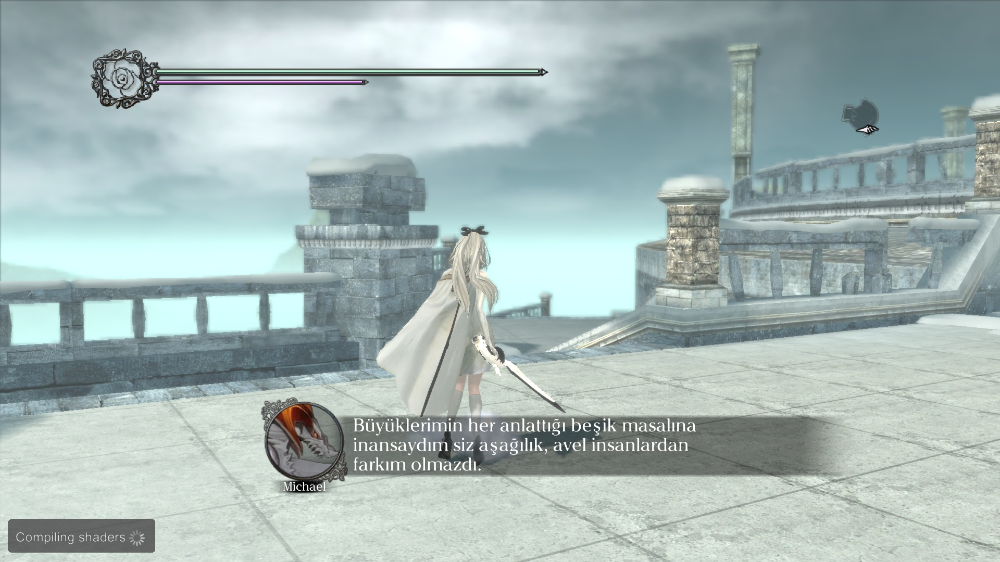 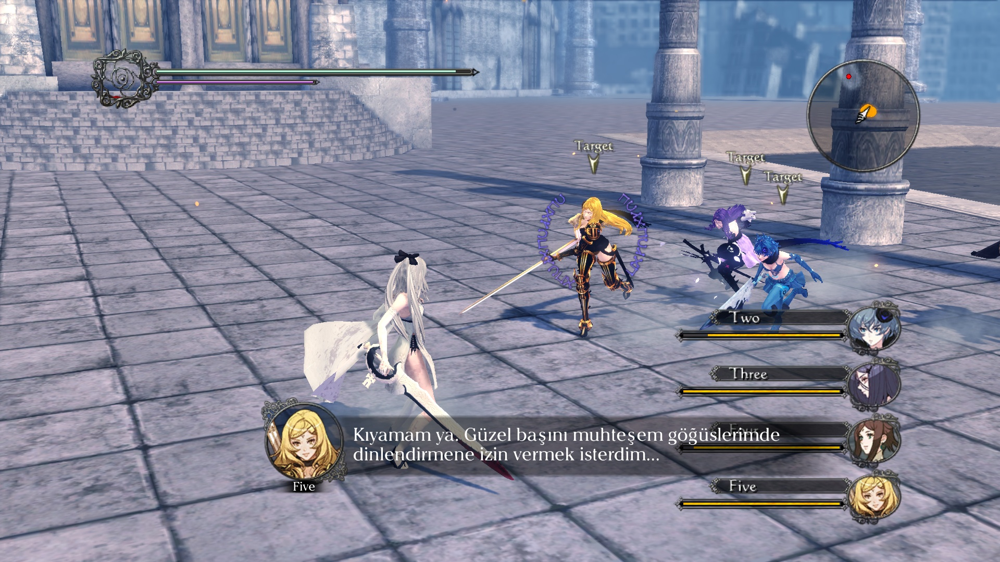
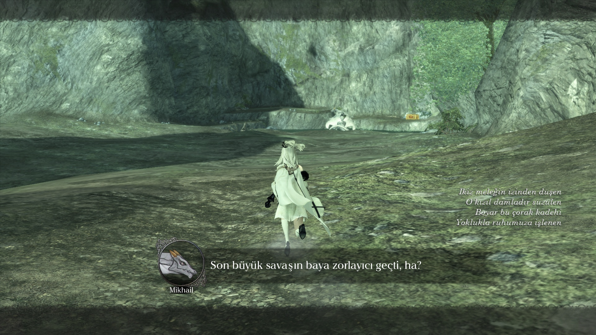 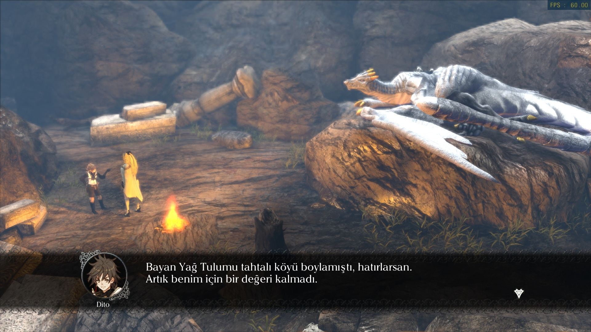

## Nasıl oynanır?
- Normalde sadece Playstation 3 platformu için çıkmış ama [RPCS3](https://rpcs3.net/) emülatörü ile PC'de oynanabilir.
- Oyunun orijinal CD'si elinizde varsa uyumlu bir optik sürücü veya jailbreaklenmiş PS3 aracılığıyla PC'ye aktarım yapılabilir. İlgili yönergeler [RPCS3 sayfasında](https://wiki.rpcs3.net/index.php?title=Help:Dumping_PlayStation_3_games) var.
- Oyunun orijinali sadece fiziksel CD olarak veya PS3 konsolu üzerinden girilen PSN mağazasından satın alınabilir. Türkiye'den satın alınabiliyor mu, alınabiliyorsa doğru sürüm mü hiç bir fikrim yok.
- Ya da daha gayri resmi bir yöntem olan *"yedi denizlere açılma"* vasıtasıyla da elde edebilirsiniz.

## İndirme & Kurulum
İndir - [Google Drive](https://drive.google.com/drive/folders/1hcWT-pk-RVAWJrT6LU02-gqcJbOcqepl?usp=drive_link)

Adım adım resimli kurulum yönergeleri Drive klasöründe PDF dosyasında yer almaktadır.

Tekrar düşününce bu oyunu yasal olarak sahip olmak oldukça zahmet gerektirdiğinden korsanlanmasını haklı buluyorum dolayısıyla oyunu ve yamanın dahil olduğu DLC'leri kolayca indirecek güvenilir kaynak da dahil ettim.

Eğer bir gün bu oyuna PC portu veya remaster falan çıkartılıp Steam gibi kolay erişilebilir platformlarda yayınlanırsa geri kaldırırım.
(Yamayı da oraya taşırım :wink:)

*"Korsanlama bir hizmet sorunudur, fiyatlandırma sorunu değil." -Gabe Newell*

*"S\*\*t Square Enix!" -Yoko Taro*

## Bilinen Kusurlar / Hatalar
- Olmayan Türkçe karakterleri mevcut kullanılmayanlarla değiştirerek modladığım için oyun bunları gösterirken önceki karakterin genişlik/yükseklik değerlerine göre render yapıyor. Dolayısıyla diğer karakterlerle yan yana geldiğinde arada hafif boşluk oluşmakta.

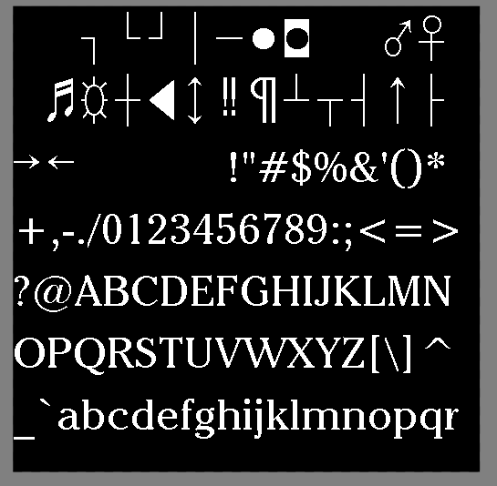 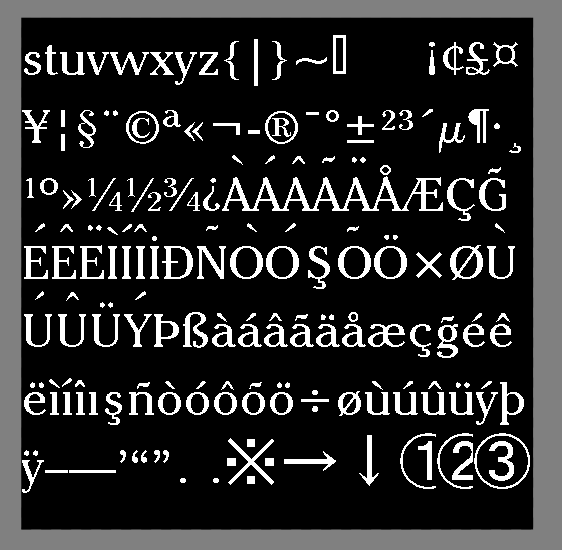

- Üstten noktalı/çentikli büyük harflerin (Ö Ü İ Ğ) noktaları gözükmemekte. Oyun, karakterlerin görüntüsünü çekerken harfin kendisinin üstündeki pikselleri (noktaların olduğu alan) okumamakta, oyundan kaynaklı bir sorun, İngilizce'de noktalı büyük harf olmadığı için yapımcılar fark etmemiş ya da düzeltmekle uğraşmamışlar.
- Bazı arayüz kısımları (düşman, item isimleri) direkt texture resmine gömülü halde olduğundan resimleri düzenleyerek değiştirdim. Oyunun kullandığı yazı tipini bir türlü bulamadığım için programda hazır ücretsiz bir tane kullandım.
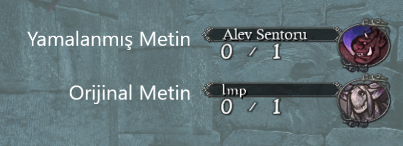

- Ara sahnelerde alt yazıları harici metinler (örn: Bölüm 1 sonu sansürü) direkt bir videodan geliyor. Oyundaki tüm ara sahneler BIK formatında 720p 30 fps videolar. Videoyu editleyerek değiştirilebilir ama o da ufacık şeyler için fazla zahmete girdiğinden uğraşmaya yeltenmedim.
- Birkaç bölümde görev yazıları (şuraya git, onu öldür, bunu yok et vs.) Türkçe görünmüyor. Optimizasyon amacıyla oyundaki aynı text tabloları 3-4 farklı dosyasında yer alıyor, hangisi hafızaya yüklenirse oyun onu kullanıyor. Bazı metin tabloların hepsini değiştirmeme rağmen orijinalini gösteriyor.
  - Sırayla etkilenen yerler: Bölüm 2 Mısra 3, Bölüm 3 Mısra 6, Bölüm 2 Kayıp Mısra

## Olası Soru-Cevap

<b>Bilgisayarım kaldırır mı? Şu kol/cihaz destekleniyor mu?</b>

Emülatör için sistem gereksinimleri, uyumlu diğer cihazlar ve diğer teknik bilgiler RPCS3'ün sitesinde yazıyor. Buraya tekrarlama gereği duymuyorum.

Referans olarak; Intel i5 13. Nesil, 16 GB RAM, RTX 4050 ve Samsung M.2 SSD kullandığım sistemimde hiç bir sorun yaşamadım, sabit 60 FPS akıcı oynatıyor. Nadiren birkaç saniyelik kasmalar oldu ama o da oyundan kaynaklı.

<b>Oyunda seste kesilmeler, anlık donmalar oluyor.</b>

Arkaplanda kaynak yiyen açık program varsa kapatmayı dene. Emülatör anlık zorlandığından oluyor bunlar.

<b>Oyunda hareketler garip geliyor. (zıplayamama, hareket hızları vb.)</b>

120 FPS üstüne çıkıldığında fizikler bozulmaya başlıyor. FPS ayarını düşürün. (RPCS3 VBlank Frequency, bkz: Kurulum.PDF)

<b>Çeviride burada belirtilmemiş bir hata buldum.</b>

GitHub hesabın varsa bu repoya issue açarak bildirebilirsin ya da <a href="https://steamcommunity.com/profiles/76561198197009265">Steam</a> veya Discord üzerinden bana ulaşabilirsin. Discord kullanıcı adım: <i>ashesbeneath</i>

Her türlü katkıda bulunanı oyun sonu credits alanına eklerim.

<b>Oyunu oynadım tüm hikayeyi bitirdim, hikaye ile ilgili merak ettiklerim var.</b>

bkz: <a href="./Lore-FAQ.md">Hikaye ile ilgili soru/cevap</a>

<b>Neden bu kadar uğraştın?</b>

Çünkü tam bir DrakeNieR hastasıyım ve keyfim geldikçe böyle şeylerle uğraşmayı seviyorum.

<b>Drakengard 1 ve 2 için de yama yapacak mısın?</b>

Dürüst olmak gerekirse oynayışlarının vasat oldukları söylendiğinden sadece videodan izlemiştim. Ama fikrim değişti ve bir gün kendim oynayıp bitirdikten sonra yapmayı düşünüyorum, ufak bir ön araştırmayla da ikisinin de dosyalarını çıkartabileceğim araçlar buldum.

## Katkıda Bulunanlar
Yamayı yaparken kullandığım program/araçların geliştiricilerine sonsuz teşekkürlerimi sunarım, bu projeyi gerçekleştirebilmemi mümkün kıldılar.

*I am eternally grateful for the developers of the programs/tools I used while making this patch, this project would not be possible without them.*
- [Sqex03DataMessage](https://github.com/lehieugch68/Drakengard-3-Sqex03DataMessage)
- [UPK Explorer](https://www.nexusmods.com/site/mods/587)
- [HxD Editor](https://mh-nexus.de/en/hxd/)
- [GIMP](https://www.gimp.org/)
- [Notepad++](https://notepad-plus-plus.org/)
- [Gildor's UE Tools](https://www.gildor.org/downloads)

> [!IMPORTANT]
> Bu projeye 2024 sonlarından başlamıştım fakat özel sebeplerden dolayı yarım bırakmıştım, yakın zamanda yeniden ele alıp bitirme fırsatım sonunda oldu. Diğer anons edilmiş projelerle bağlantısı yoktur.

> Kendime not:
> Daha iyi SOL indexlemesi için Github Pages sitesi hazırla
> Lore FAQ tamamla
> Anksiyetini yenip birkaç foruma post at
